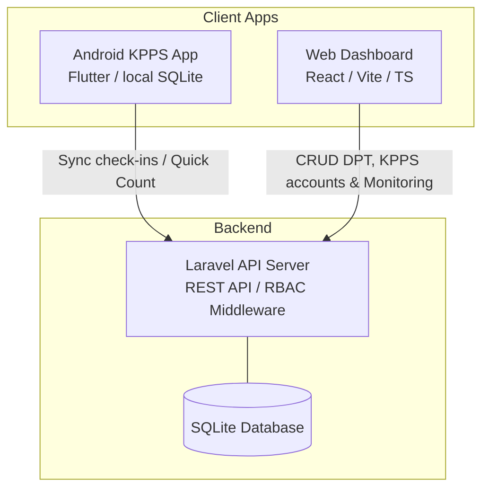
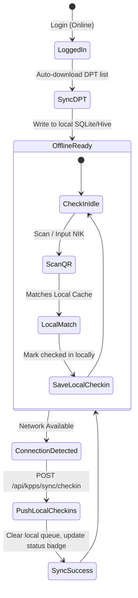

# Architecture Design Document — KPPS Gentan System

This document outlines the software architecture, database design, API specification, and technical execution plan for the **KPPS Android App** and **Secretariat Web Dashboard** system.

---

## 1. Architectural Overview

The system is designed with a decoupled, modular architecture consisting of three core parts:
1.  **Backend API (`/backend`)**: A Laravel 11+ application acting as the single source of truth. It hosts the REST API endpoints and stores data in a SQLite database.
2.  **Web Dashboard (`/web`)**: A React (Vite + TypeScript) application used by the Secretariat. Built using Vanilla CSS with modern HSL/OKLCH colors and strict access controls.
3.  **Mobile Client (`/mobile`)**: A Flutter application used by KPPS officers in the field. Incorporates SQLite/local cache storage and sync mechanisms to operate fully offline-first.



---

## 2. Technology Stack & Directory Structure

```
D:\Coding\KPPS Gentan\
├── backend\          # Laravel 11 API Server (PHP 8.4)
├── web\              # Web Dashboard (React + TypeScript + Vite)
├── mobile\           # Mobile Application (Flutter 3.35)
└── ARCHITECTURE.md   # Architectural decisions and blueprints
```

---

## 3. Database Schema (SQLite)

We will use SQLite as the database engine for simplicity, portability, and zero-config local startup.

### 3.1. Tables Definition

#### `tps` (TPS Locations)
*   `id`: `INTEGER` (Primary Key, Autoincrement)
*   `nama`: `VARCHAR(100)` (e.g., "TPS 01")
*   `wilayah`: `VARCHAR(255)` (e.g., "Gentan, Baki, Sukoharjo")
*   `total_dpt`: `INTEGER` (Pre-calculated sum of voters for caching/quick access)
*   `created_at`, `updated_at`: `TIMESTAMP`

#### `users` (Authentication & RBAC)
*   `id`: `INTEGER` (Primary Key, Autoincrement)
*   `username`: `VARCHAR(100)` (Unique)
*   `password`: `VARCHAR(255)` (Hashed)
*   `role`: `VARCHAR(20)` (`sekretariat` or `kpps`)
*   `tps_id`: `INTEGER` (Foreign Key pointing to `tps.id`, nullable for `sekretariat`)
*   `created_at`, `updated_at`: `TIMESTAMP`

#### `dpt` (Daftar Pemilih Tetap - Master Voter List)
*   `nik`: `VARCHAR(16)` (Primary Key - NIK is unique and 16 digits)
*   `nama`: `VARCHAR(255)`
*   `tps_id`: `INTEGER` (Foreign Key pointing to `tps.id`)
*   `status_hadir`: `BOOLEAN` (Default: `false` / `0`)
*   `waktu_checkin`: `TIMESTAMP` (Nullable)
*   `qr_payload`: `TEXT` (Hashed/Base64 representation of voter registration details)
*   `created_at`, `updated_at`: `TIMESTAMP`

#### `quick_counts` (Quick Count Results)
*   `tps_id`: `INTEGER` (Primary Key, Foreign Key to `tps.id`)
*   `kandidat_1`: `INTEGER` (Default: `0`)
*   `kandidat_2`: `INTEGER` (Default: `0`)
*   `kandidat_3`: `INTEGER` (Default: `0`)
*   `suara_tidak_sah`: `INTEGER` (Default: `0`)
*   `status`: `VARCHAR(20)` (`draft` or `final`)
*   `submitted_at`: `TIMESTAMP` (Nullable)
*   `created_at`, `updated_at`: `TIMESTAMP`

#### `sync_logs` (Telemetry for Offline Sync Tracker)
*   `id`: `INTEGER` (Primary Key, Autoincrement)
*   `tps_id`: `INTEGER` (Foreign Key to `tps.id`)
*   `device_id`: `VARCHAR(255)`
*   `action`: `VARCHAR(100)` (e.g., "voter_checkin", "quick_count_submit")
*   `payload`: `TEXT` (JSON representation of the sync batch payload)
*   `waktu_sync`: `TIMESTAMP`

---

## 4. API Endpoints Specification

All endpoints require standard Bearer Token Authentication unless specified.

### 4.1. Authentication
*   `POST /api/login` (Public)
    *   Body: `{ "username": "...", "password": "..." }`
    *   Response: `{ "token": "...", "user": { "id", "username", "role", "tps_id" } }`

### 4.2. Secretariat-Only Dashboard & Management (`role: sekretariat`)
*   `GET /api/dashboard/summary`
    *   Returns: overall attendance stats, reporting status, aggregates of quick count votes.
*   `GET /api/dashboard/tps/{id}`
    *   Returns: detailed attendance and quick count data for a specific TPS.
*   `GET /api/tps` (List and filter all TPS locations)
*   `POST /api/tps` (Create a new TPS)
*   `GET /api/dpt` (Fetch paginated DPT list)
*   `POST /api/dpt` (Single insert DPT)
*   `POST /api/dpt/import` (Upload CSV file of DPT list)
*   `POST /api/users` (Provision KPPS accounts)
*   `GET /api/users` (List user accounts)

### 4.3. KPPS & Synchronization Endpoints (`role: kpps` or `sekretariat`)
*   `GET /api/kpps/dpt`
    *   *Scoped to current KPPS TPS*. Retrieves all voters for this specific TPS to build the offline cache.
*   `POST /api/kpps/sync/checkin`
    *   Body: `{ "checkins": [ { "nik": "...", "waktu_checkin": "..." } ] }`
    *   Process: Idempotent processing. Marks corresponding DPT as checked in.
*   `POST /api/kpps/sync/quick-count`
    *   Body: `{ "kandidat_1": 120, "kandidat_2": 95, "kandidat_3": 45, "suara_tidak_sah": 4, "status": "final" }`
    *   Process: Saves quick count values. Locked if status is "final".

---

## 5. Offline-First Sync State Machine (Flutter App)



---

## 6. Implementation Plan & Progress Gate

1.  **Step 1: Setup Backend Server (`/backend`)**
    *   Initialize Laravel project.
    *   Implement models, migrations, seeds (including default `sekretariat` admin and mock `kpps` accounts).
    *   Build Authentication routes and Middleware for RBAC.
    *   Build CRUD endpoints, bulk CSV import, and synchronization endpoints.
2.  **Step 2: Setup Web Dashboard (`/web`)**
    *   Initialize React-Vite project with TypeScript.
    *   Write CSS custom variables utilizing OKLCH colors.
    *   Implement login page, dashboard monitor (aggregates, progress stats), and DPT CSV importer.
3.  **Step 3: Setup Flutter App (`/mobile`)**
    *   Initialize Flutter project.
    *   Implement local repository using `sqflite` or custom JSON cache repository.
    *   Build Login page, Scanner module, Check-In tracker, and Quick Count form.
    *   Write background connection observer and syncing logic.
4.  **Step 4: Integration testing and verification**
    *   Validate RBAC restrictions (ensuring KPPS token cannot access CRUD DPT APIs).
    *   Run local integration tests.
